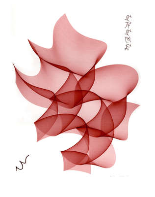
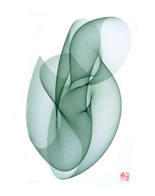
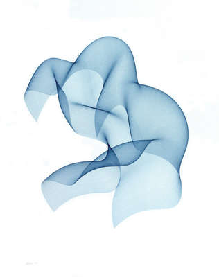

# Vorprojekt

## Inspiration / Originalwerk
### »Cyber Flowers« by Roman Verostko
    
[compArt: »Cyber Flowers« by Roman Verostko](http://dada.compart-bremen.de/item/artwork/916)  
[Roman Verostko](http://www.verostko.com/)

### Analyse, Interessante Ansätze & Gedanken.

Roman Verostko hat eine Linie gezeichnet und diese seinen Algorythmus eingespeist. Dieser hat die Linieninformation verarbeitet und transformiert. Die Linien wurden anschliessend von einem XY plotter mit einem eingespannten stift auf ein Papierformat gemalt. Dabei hat er sich jeweils zu den resultierenden Zeichnungen die Frage gestellt "Was ist das ?" So entstand auch der Name für die Werksammlung "Cyber flowers".

Wir fanden den Ansatz spannend, dass aus einer beliebigen einfachen Linie ein grafisches werk entsteht interessant. Eine interessante dynamik ist, dass der Künstler selber nicht die ganze kontrolle über das werk hat. Er kann einen Input geben und am schluss sich fragen, was ist das jetzt? Im Prozess entsteht so ein gewisses gefühl der Machtlosigkeit und ein element des Kontrollverlusts über die Kreation. Dies könnte auch interessante Fragen bezüglich des Urhebertums der Werke auslösen.

## Werk Sandro

## Werk Melanie
